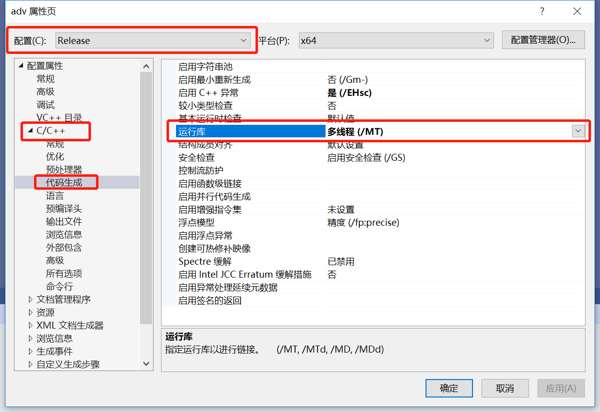

# HorseJs 源码构建指南

此文档不是针对普通开发者的，而是针对那些希望为 HorseJs 贡献代码或者为新项目做技术审核的专业人员的

首先在[wxWidgets 官网下载页面](https://www.wxwidgets.org/downloads/)下载 wxWidgets 的源码安装包（Windows Installer）

下载安装完成后，在安装目录\build\msw 子目录下，找到适合你的工程文件，VS2019 对应的是 wx_vc16.sln

打开工程，把工程下每个子项目的 Release 运行库改为多线程（/MT），Debug 运行库改为（/MTd）

两次重新生成整个解决方案，Release 生成一次，Debug 生成一次，此时\lib\vc_x64_lib 目录下将生成依赖所需的一众.lib 文件（目录下同时包含 Release 的库和 Debug 的库）。如果你需要 32 位的库，那么你应该再为 32 位的 Release 和 Debug 生成两次
