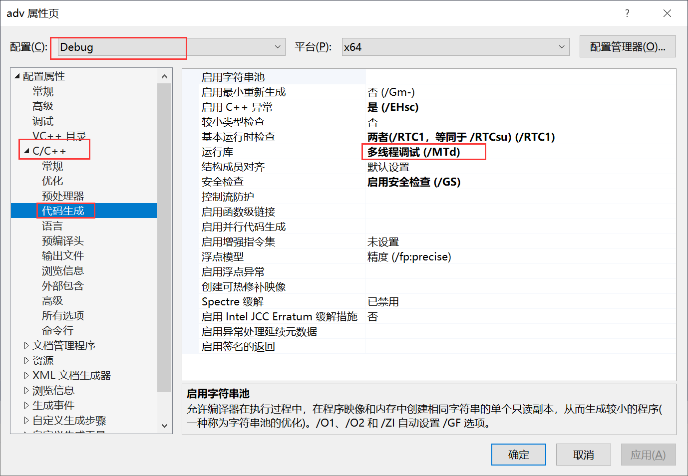
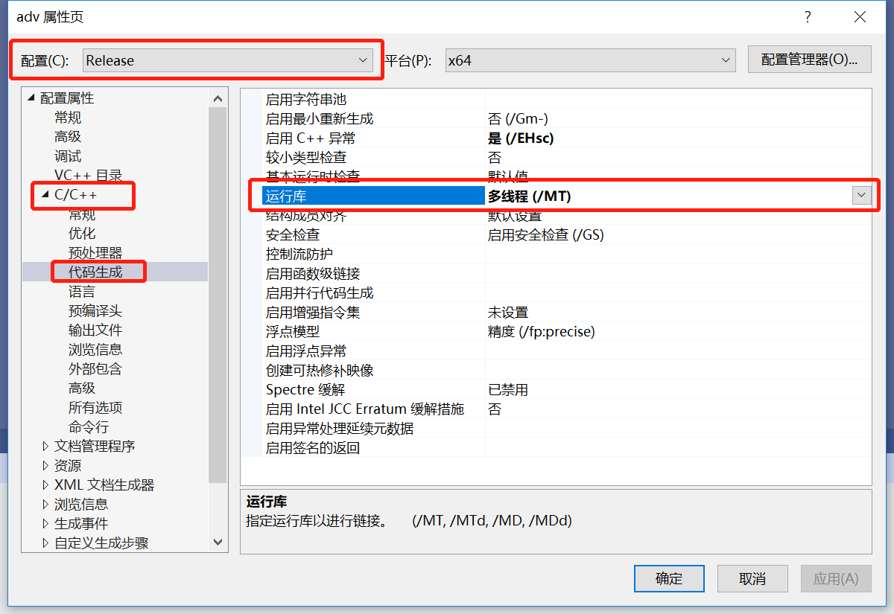

此文档不是提供给普通开发者的，而是提供给那些希望为 HorseJs 贡献代码的专业人员的

# Debug 编译

## 准备 wxWidgets

首先在[wxWidgets 官网下载页面](https://www.wxwidgets.org/downloads/)下载 wxWidgets 的源码安装包（Windows Installer）

下载安装完成后，在安装目录\build\msw 子目录下，找到适合你的工程文件，VS2019 对应的是 wx_vc16.sln

打开工程，把工程下每个子项目的 Debug 运行库改为（/MTd）`注意是MTd`

<div align=center>

</div>

为每个子项目增加预处理器定义

```
_ITERATOR_DEBUG_LEVEL=0
```

以 Debug 的方式重新生成整个解决方案，执行完成后，把整个 wxWidgets 源码拷贝至 horsejs 根目录下的 wxWidgetsDebug 文件夹内

## 准备 cef

到[cef 官网](https://cef-builds.spotifycdn.com/index.html#windows64)下载合适的 cef 版本

下载完成后，打开 build\cef.sln，修改 libcef_dll_wrapper 子项目的运行库为：多线程调试 (/MTd)，

重新生成 libcef_dll_wrapper 子项目，然后把 cef 项目所在目录下的所有内容拷贝至 horsejs 根目录下的 cefDebug 目录内

## 准备 二进制资源

在 Debug 模式下启动 HorseJs，如果启动失败，则：

把 cefDebug\Debug 目录下的内容拷贝至 horsejs\x64\Debug 目录下

把 cefDebug\Resources 目录下的内容也拷贝至 horsejs\x64\Debug 目录下

拷贝完成后再次启动项目，就可以成功运行了。

# Release 编译

（此文档尚未完成）

删除 Debug 编译时 wxWidgets 源码目录下 lib\vc_x64_lib 子目录下的所有内容，然后以 Debug 的方式再次重新生成整个解决方案，执行完成后，把整个 wxWidgets 源码拷贝至 HorseJs 跟目录下的 wxWidgetsDebug 文件夹内

Release 运行库改为多线程（/MT），

以 Release 的方式重新生成整个解决方案，执行完成后，把整个 wxWidgets 源码拷贝至 HorseJs 跟目录下的 wxWidgetsRelease 文件夹内

<div align=center>

</div>

# 其他

以下内容仅供学习，Horse 项目已经配置好了，不需要开发者自行配置：

```
C++附加包含目录:
$(SolutionDir)wxWidgetsDebug\include;$(SolutionDir)wxWidgetsDebug\include\msvc
```

```
连接器附加库目录
$(SolutionDir)wxWidgetsDebug\lib\vc_x64_lib
```
