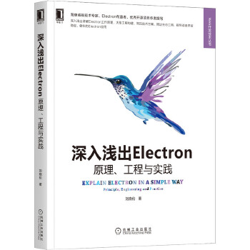

<div align=center>

<br />
健壮 | 优雅 | 迅捷
<br />
使用 HTML/JS/CSS 创建更快速、更稳定的桌面应用。
<br />
QQ交流群：650631559；微信公众号：桌面软件
</div>

# 说明

HorseJs 是一个与 Electron 类似的框架，与 Electron 不同的是它没有内置 Node.js，而是直接使用 C++ 提供了大部分 Electron 的能力，比如使用 JavaScript 访问文件、打开对话框、创建新窗口等。由于没有 Node.js，所以 HorseJs 运行速度更快、占用内存更少、稳定性也更高。

HorseJs 可以直接加载 webpack 或 Rollup 构建的任何前端项目，由于这些构建工具会把 npm 包内的代码捆扎到你的最终产物中，所以开发者可以在这类项目中使用任何 npm 包，HorseJs 并不排斥 Node.js 的生态。

使用 HorseJs 开发应用，不必考虑任何渲染进程、主进程以及这些进程之间通信的问题。因为这些工作 HorseJs 已经帮开发者做掉了。开发者只要专注自己的业务逻辑即可。

# 起步

## 第一步

下载 [HorseJs](https://gitee.com/horsejs/horsejs/releases) 的二进制文件（扩展名为 7z 的压缩包）解压后，启动压缩包内的 HorseJs.exe，进入 Demo 界面可以看到随 SDK 附带的各种 API 的示例；

<div align=center>

</div>

## 第二步

在你的前端工程下执行如下指令安装 HorseJs 的 npm 包

```cmd
npm install horsejs.org
```

之后你就可以使用如下方式调用 HorseJs 为你提供的 API 了

```js
import { horse } from "horsejs.org";
await horse.window.openDevTool();
```

> HorseJs 的 npm 包并非原生模块，无需本地编译；支持 TypeScript 类型
>
> 你可以自由的使用 Vue、React、Angular 或者其他的现代前端框架构建你的前端项目

## 第三步

修改第一步中下载的文件：HorseJs\app\horse.config.json

使其 startPath 配置项指向你的调试地址，比如：

```url
"startPath": "http://localhost:3000/"
```

再次启动 HorseJs.exe，观察你的调试页面在 HorseJs 下的表现

> HorseJs 内置 Chromium 浏览器核心，支持热更新，你可以把它当做一个浏览器

## 第四步

开发完成后，把你的前端工程构建产物 ，放置到 HorseJs\app\ 目录下，（该目录下原有的文件，除 horse.config.json 外均应删除），并再次修改 horse.config.json 的 startPath 配置项，使其指向你的起始页面，比如：

```url
"startPath": "app/index.html"
```

## 第五步

你可以使用 [Resource Hacker](http://angusj.com/resourcehacker/) 之类的工具修改 HorseJs.exe 的图标或属性信息；

你可以使用 [NSIS](https://nsis.sourceforge.io/) 或 [InnoSetup](https://jrsoftware.org/isinfo.php) 之类的工具把 HorseJs 目录下的内容制作成一个安装文件，分发给你的用户；

> 以后我会提供相应的工具链方便开发者使用它们

# 文档

- [配置文件](Doc/Config.md)
- [全局对象](Doc/Horse.md)
  - [基础信息](Doc/Horse/Info.md)
  - [窗口控制](Doc/Horse/Window.md)
  - [对话框](Doc/Horse/Dialog.md)
  - [剪切板](Doc/Horse/Clipboard.md)
  - [文件](Doc/Horse/File.md)
  - [路径](Doc/Horse/Path.md)
  - [系统](Doc/Horse/System.md)
  - [菜单](Doc/Horse/Menu.md)
  - [托盘图标](Doc/Horse/Tray.md)
  - [数据库](Doc/Horse/Db.md)
  - [原生插件](Doc/Horse/Plugin.md)
- [可拖拽区域](Doc/AppRegion.md)
- [源码构建指南](Doc/HorseJsBuild.md)
- [升级记录](Doc/Update.md)

# 其他

1.  本项目基于 MIT 协议开源，大家可以放心使用；
2.  目前此项目尚处于实验验证阶段，将来我会逐步为其添加各项功能及辅助的工具；
3.  欢迎并感谢大家提 Issue 和 Pull Request；
4.  本项目基于 cef 和 wxWidgets 开发，大量参考了 Electron 、Node.js、 Chromium 的源码，Thanks。

# 赞助


微信收款码

> 如果赞助者希望把名字添加到 HorseJs 主页，可以通过 QQ （412588801）联系我

# 作者新书

《深入浅出 Electron》(刚刚上架)




---


<div align=center>

<br />
robust | elegant | swift
<br />
Create faster and more stable desktop applications using HTML/JS/CSS.
<br />
QQ exchange group: 650631559; WeChat public account:桌面软件 (desktop software)
</div>

# What is it?

HorseJs is a framework similar to Electron. Unlike Electron, it has no built-in Node.js, but directly uses C++ to provide most of Electron's capabilities, such as accessing files using JavaScript, opening dialog boxes, creating new windows, etc. Since there is no Node.js, HorseJs runs faster, uses less memory, and is more stable.

HorseJs can directly load any front-end project built by `webpack` or `rollup`. Since these build tools will bundle the code in the `npm` package into your final product, developers can use any `npm` package in this type of project. HorseJs does not exclude the Node.js ecosystem.

Using HorseJs to develop applications, you don't have to consider any rendering process, the main process and the communication between these processes. Because of the work HorseJs has already done for the developers, developers only need to focus on their own business logic.

# Start using HorseJs

## first step

Download the binary file of [HorseJs](https://gitee.com/horsejs/horsejs/releases) (compressed package with the extension `7z`) and decompress it, start `HorseJs.exe` from the compressed package and enter the Demo interface to see examples of various APIs that come with the SDK;

<div align=center>

</div>

## second step

Execute the following command under your front-end project to install the `npm` package of HorseJs:

```cmd
npm install horsejs.org
```

After that, you can use the following methods to call the API provided by HorseJs for you:

```js
import { horse } from "horsejs.org";
await horse.window.openDevTool();
```

> HorseJs's `npm` package is not a native module and does not require local compilation; it supports TypeScript types.
>
> You are free to build your front-end projects using Vue, React, Angular or any other modern front-end frameworks.

## third step

Modify the file downloaded in the first step: `HorseJs\app\horse.config.json`

Make its `startPath` configuration point to your debug address, for example:

```url
"startPath": "http://localhost:3000/"
```

Start `HorseJs.exe` again and observe how your debug page behaves under HorseJs.

> HorseJs has the Chromium browser core built-in, supports hot update, so you can use it as a regular browser.

## the fourth step

After the development is completed, put your front-end project construction product into the `HorseJs\app\` directory (the original files in this directory should be deleted except `horse.config.json`), and modify `horse.config.json` again. Point the `startPath` configuration item to your start page, for example:

```url
"startPath": "app/index.html"
```

## the fifth step

You can use tools like [Resource Hacker](http://angusj.com/resourcehacker/) to modify the icon or property information of `HorseJs.exe`;

You can use tools like [NSIS](https://nsis.sourceforge.io/) or [InnoSetup](https://jrsoftware.org/isinfo.php) to make a setup file from the contents of the `HorseJs` directory and distribute it to your users;

> In the future, I will provide corresponding toolchains for developers to use them.

# Documentation

- [configuration file](Doc/Config.md)
- [global object](Doc/Horse.md)
  - [basic information](Doc/Horse/Info.md)
  - [window control](Doc/Horse/Window.md)
  - [dialog](Doc/Horse/Dialog.md)
  - [clipboard](Doc/Horse/Clipboard.md)
  - [document](Doc/Horse/File.md)
  - [path](Doc/Horse/Path.md)
  - [system](Doc/Horse/System.md)
  - [menu](Doc/Horse/Menu.md)
  - [tray icon](Doc/Horse/Tray.md)
  - [database](Doc/Horse/Db.md)
  - [Native plugin](Doc/Horse/Plugin.md)
- [draggable area](Doc/AppRegion.md)
- [Source code build guide](Doc/HorseJsBuild.md)
- [Upgrade record](Doc/Update.md)

# Misc.

1.  This project is open source using the MIT license, and you can use it with confidence;
2.  At present, this project is still in the experimental verification stage, and I will gradually add various functions and auxiliary tools to it in the future;
3.  Welcome and thank you for raising Issues and Pull Requests;
4.  This project is developed based on CEF3 and wxWidgets, with a lot of reference to the source code of Electron, Node.js, and Chromium, thanks.

# Sponsoring


WeChat payment code

> If sponsors want to add their name to the HorseJs homepage, they can contact me via QQ (412588801)

# Author's new book

《In-depth Electron》(just launched)


