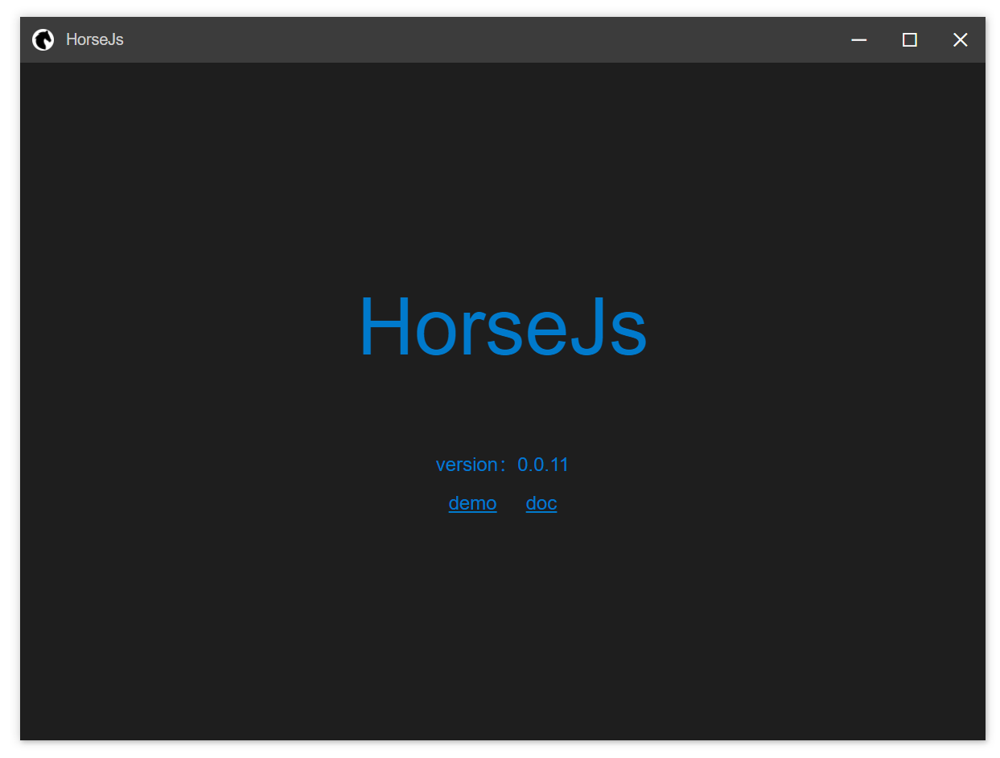
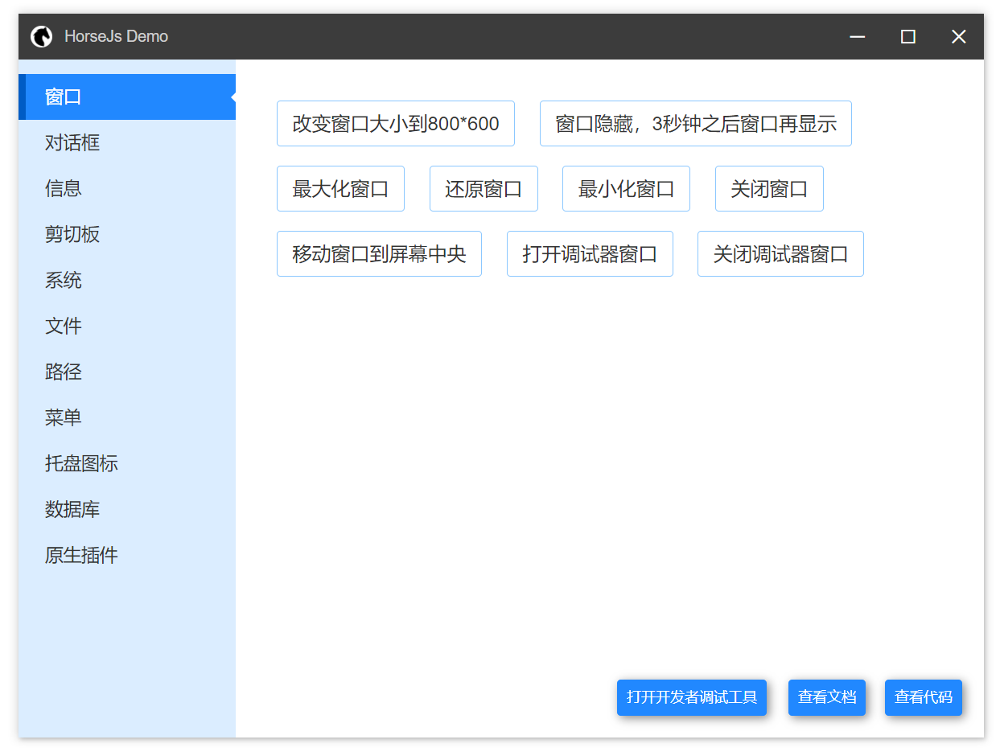

<div align=center>

<br />
健壮 | 优雅 | 迅捷
<br />
使用 HTML/JS/CSS 创建更快速、更稳定的桌面应用。
<br />
QQ交流群：650631559；微信公众号：桌面软件
</div>

# 说明

HorseJs 是一个与 Electron 类似的框架，与 Electron 不同的是它没有内置 Node.js，而是直接使用 C++ 提供了大部分 Electron 的能力，比如使用 JavaScript 访问文件、打开对话框、创建新窗口等。由于没有 Node.js，所以 HorseJs 运行速度更快、占用内存更少、稳定性也更高。

HorseJs 可以直接加载 webpack 或 Rollup 构建的任何前端项目，由于这些构建工具会把 npm 包内的代码捆扎到你的最终产物中，所以开发者可以在这类项目中使用任何 npm 包，HorseJs 并不排斥 Node.js 的生态。

使用 HorseJs 开发应用，不必考虑任何渲染进程、主进程以及这些进程之间通信的问题。因为这些工作 HorseJs 已经帮开发者做掉了。开发者只要专注自己的业务逻辑即可。

# 起步

## 第一步

下载 [HorseJs](https://gitee.com/horsejs/horsejs/releases) 的二进制文件（扩展名为 7z 的压缩包）解压后，启动压缩包内的 HorseJs.exe，进入 Demo 界面可以看到随 SDK 附带的各种 API 的示例；

<div align=center>

</div>

## 第二步

在你的前端工程下执行如下指令安装 HorseJs 的 npm 包

```cmd
npm install horsejs.org
```

之后你就可以使用如下方式调用 HorseJs 为你提供的 API 了

```js
import { horse } from "horsejs.org";
await horse.window.openDevTool();
```

> HorseJs 的 npm 包并非原生模块，无需本地编译；支持 TypeScirpt 类型
>
> 你可以自由的使用 Vue、React、Angular 或者其他的现代前端框架构建你的前端项目

## 第三步

修改第一步中下载的文件：HorseJs\app\horse.config.json

使其 startPath 配置项指向你的调试地址，比如：

```url
"startPath": "http://localhost:3000/"
```

再次启动 HorseJs.exe，观察你的调试页面在 HorseJs 下的表现

> HorseJs 内置 Chromium 浏览器核心，支持热更新，你可以把它当做一个浏览器

## 第四步

开发完成后，把你的前端工程构建产物 ，放置到 HorseJs\app\ 目录下，（该目录下原有的文件，除 horse.config.json 外均应删除），并再次修改 horse.config.json 的 startPath 配置项，使其指向你的起始页面，比如：

```url
"startPath": "app/index.html"
```

## 第五步

你可以使用 [Resource Hacker](http://angusj.com/resourcehacker/) 之类的工具修改 HorseJs.exe 的图标或属性信息；

你可以使用 [NSIS](https://nsis.sourceforge.io/) 或 [InnoSetup](https://jrsoftware.org/isinfo.php) 之类的工具把 HorseJs 目录下的内容制作成一个安装文件，分发给你的用户；

> 以后我会提供相应的工具链方便开发者使用它们

# 文档

- [配置文件](Doc/Config.md)
- [全局对象](Doc/Horse.md)
  - [基础信息](Doc/Horse/Info.md)
  - [窗口控制](Doc/Horse/Window.md)
  - [对话框](Doc/Horse/Dialog.md)
  - [剪切板](Doc/Horse/Clipboard.md)
  - [文件](Doc/Horse/File.md)
  - [路径](Doc/Horse/Path.md)
  - [系统](Doc/Horse/System.md)
  - [菜单](Doc/Horse/Menu.md)
  - [托盘图标](Doc/Horse/Tray.md)
  - [数据库](Doc/Horse/Db.md)
  - [原生插件](Doc/Horse/Plugin.md)
- [可拖拽区域](Doc/AppRegion.md)
- [源码构建指南](Doc/HorseJsBuild.md)
- [升级记录](Doc/Update.md)

# 其他

1.  本项目基于 MIT 协议开源，大家可以放心使用；
2.  目前此项目尚处于实验验证阶段，将来我会逐步为其添加各项功能及辅助的工具；
3.  欢迎并感谢大家提 Issue 和 Pull Request；
4.  本项目基于 cef 和 wxWidgets 开发，大量参考了 Electron 、Node.js、 Chromium 的源码，Thanks。

# 赞助


微信收款码

> 如果赞助者希望把名字添加到 HorseJs 主页，可以通过 QQ （412588801）联系我
