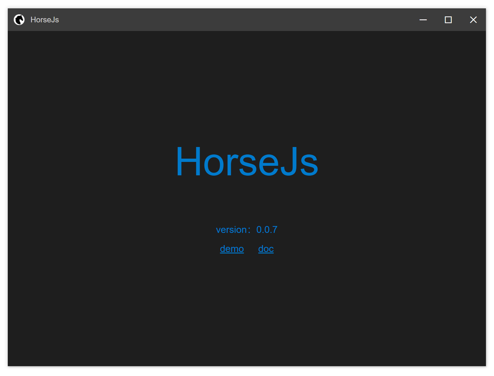

# HorseJs

# 介绍

使用 HTML/JS/CSS 创建更快速、更稳定的桌面应用。

# 说明

HorseJs 是基于 cef 开发的，没有内置 Node.js，它直接使用 C++提供了类似 Electron 或 NW.js 的能力，比如使用 JavaScript 访问文件（或目录）、打开对话框、访问剪切板、创建托盘图标等。

由于没有 Node.js，所以 HorseJs 运行速度更快，Electron 创建一个新的 BrowserWindow 是非常低效的，HorseJs 就没有这个问题，同样的，少了了很多 Node.js 的干扰，HorseJs 应用也会变得更稳定。

HorseJs 可以直接加载 webpack 或 Rollup 构建的任何前端项目，因为构建工具会把你的依赖包构建到你的最终产物中，所以开发者可以在这类项目中使用任何 npm 包，但 HorseJs 并不支持在生产环境中加载 Node.js 的原生模块。

# 起步

1.  下载 HorseJs 的二进制文件并解压到目录 yourAppName 中，这个目录的名字你可以随便取
2.  在 yourAppName 的目录下新建 app 子目录，并把你的静态文件（HTML,JS 与 CSS）放置到该目录下，而且 app 目录下必须包含一个名为 index.html 的文件，应用的第一个窗口将加载这个文件。
3.  启动 HorseJs.exe 你将会看到你的第一个应用；
4.  你可以使用 [Resource Hacker](http://angusj.com/resourcehacker/) 之类的工具修改 HorseJs.exe 的图标或属性信息；
5.  你可以使用 [NSIS](https://nsis.sourceforge.io/) 或 [InnoSetup](https://jrsoftware.org/isinfo.php) 之类的工具把 yourAppName 目录下的内容制作成一个安装文件，分发给你的用户；

# 文档

- [快速入门](Doc/QuickStart.md)

- [配置文件](Doc/Config.md)

- [全局对象](Doc/Horse.md)

  - [基础信息](Doc/Horse/Info.md)

  - [窗口控制](Doc/Horse/Window.md)

  - [对话框](Doc/Horse/Dialog.md)

- [可拖拽区域](Doc/AppRegion.md)

# 其他

1.  本项目基于 MIT 协议开源，大家可以放心使用；
2.  目前此项目尚处于实验验证阶段，将来我会逐步为其添加各项功能及辅助的工具；
3.  欢迎并感谢大家提 Issue，但暂时不接受 Pull Request；
